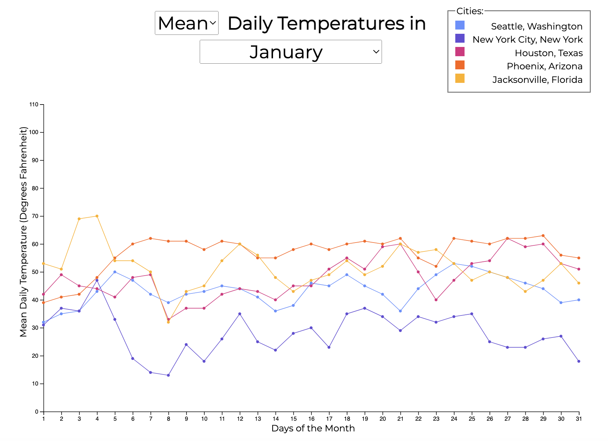

# Temperature Data Project and Graph

## Description
[This project](https://hannah627.github.io/weather-data/) was a way to learn and practice using D3. To do so, I created an interactive graph showing temperature data for 5 US cities (Seattle, NYC, Houston, Phoenix, and Jacksonville), for each month. Hovering data points displays a tooltip with the specific city and temperature at that point, and clicking a data point or a marker in the legend will "focus" a city by graying out the lines for the others.

## The Graph

*Above is a static view of the graph, the one that shows when the site loads - looking at the mean temperatures for the five cities in January*

While this graph can be viewed statically, it was intended for user interaction, which can be gained by visiting [the interactive site](https://hannah627.github.io/weather-data/).

## The Data
The dataset contains a 1 year (12month) weather history scrapped from Wunderground for multiple US cities. Each CSV file has the following columns:

| Column | Description |
| ------ | ----------- |
| date | The date of the weather record, formatted YYYY-M-D |
| actual_mean_temp | The measured average temperature for that day |
| actual_min_temp |	The measured minimum temperature for that day |
| actual_max_temp |	The measured maximum temperature for that day |
| average_min_temp | The average minimum temperature on that day since 1880 |
| average_max_temp | The average maximum temperature on that day since 1880 |
| record_min_temp | The lowest ever temperature on that day since 1880 |
| record_max_temp | The highest ever temperature on that day since 1880 |
| record_min_temp_year | The year that the lowest ever temperature occurred |
| record_max_temp_year | The year that the highest ever temperature occurred |
| actual_precipitation | The measured amount of rain or snow for that day |
| average_precipitation | The average amount of rain or snow on that day since 1880 |
| record_precipitation | The highest amount of rain or snow on that day since 1880 |

